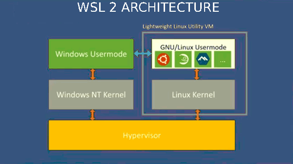

# WSL2
## ARQUITECTURA

###  cómo funciona la versión 2 del subsistema que permite ejecutar aplicaciones de Linux en Windows y como tiene acceso al sistema de archivos de Windows.

WSL 2 es una nueva versión de la arquitectura del Subsistema de Windows para Linux que permite que el Subsistema de Windows para Linux ejecute archivos binarios de ELF64 de Linux en Windows. Sus principales objetivos son aumentar el rendimiento del sistema de archivos y agregar compatibilidad completa con las llamadas del sistema.

Esta nueva arquitectura cambia el modo en que estos archivos binarios de Linux interactúan con Windows y con el hardware del equipo, pero proporciona la misma experiencia de usuario que en WSL 1 (la versión disponible de forma general actualmente).

Las distribuciones de Linux individuales se pueden ejecutar con la arquitectura de WSL 1 o WSL 2. Cada distribución se puede actualizar o degradar en cualquier momento, y puedes ejecutar distribuciones de WSL 1 y WSL 2 en paralelo. WSL 2 usa una arquitectura completamente nueva que aprovecha las ventajas de un kernel de Linux real.

## VENTAJAS

### ventajas WSL frente a otros sistemas de virtualización como las maquinas virtuales. 

WSL necesita menos recursos (CPU, memoria y almacenamiento) que una máquina virtual completa. Asimismo, WSL también te permite ejecutar aplicaciones y herramientas de línea de comandos de Linux junto con la línea de comandos de Windows, aplicaciones de escritorio y de Store, así como la posibilidad de acceder a los archivos de Windows desde Linux. Esto te permite usar las aplicaciones de Windows y las herramientas de línea de comandos de Linux en el mismo conjunto de archivos, si así lo deseas.

## INSTALACION

### servicios de Windows que deben habilitarse para la correcta ejecución de WSL2.

Para la correcta ejecucion del servicios de Windows que deben habilitarse para la correcta ejecución de WSL2.

Se procede hacer la intalacion de WSL2, dando continuacion a cada uno de los pasos a seguir. Ya que es una herrmienta de desarrollo muy popular en window.

Aceptamos el permiso que  windows instale esta aplicasion dandole YES.

A continuacion comienza la instalacion del programa, tardara unos minutos.

Cuando termino la intalacion wsl2, damos final.

Entramos a windows powershell y lo ejecutamos como administrador

Ejecutamos el codigo (wls --set-default-version 2)

Continuamos realizando una instalacion en base de Ubuntu, a travez de la Microsoft Store desde el enlace.

Cuando termino la descarga,iniciamos la aplicasion y esperamos que termine el proceso y establesemos nuestro usuario y contraseña de nueestra distribucion en linux.

Abrimos Powershell presionando la combinacion de las teclas Windows + r y escribimos powershel, y le damos aceptar.

Nos abrira una terminal donde ejecutaremos el siguiente comando, Wsl -- list -- verbose, donde al ejecutarse se despliega una lista de distribucones instaladas en la maquina.

Establesemos la version 2 y corremos el siguiente comando  wsl -- set - version.

Listo, tenemos WSL2  disponible para desarrollar.

